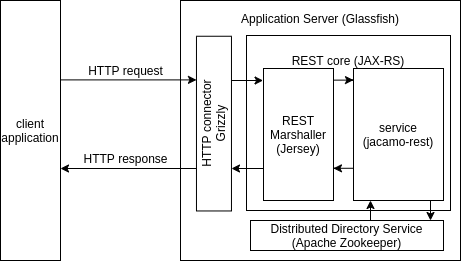
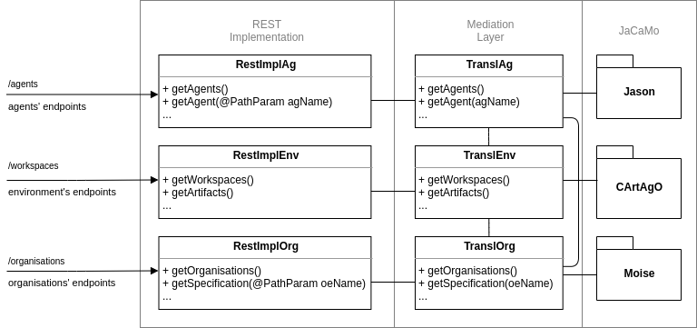

JaCaMo REST provides a REST API to interact with agents, artifact and the organisation.

# Using this project

Include jacamo-rest dependency in `build.gradle`:

```
repositories {
    mavenCentral()

    maven { url "https://raw.github.com/jacamo-lang/mvn-repo/master" }
    maven { url "http://jacamo.sourceforge.net/maven2" }

}

dependencies {
    compile group: 'org.jacamo', name: 'jacamo-rest', version: '0.2-SNAPSHOT'
}
```

and start the API server in your `.jcm` application file:

```
mas yourmas {

    ...

    // starts rest api on port 8080
    platform: jacamo.rest.JCMRest("--main 2181 --restPort 8080")

}

```

# Running this project

### Using a local gradle
* `$ gradle marcos` runs agent marcos and the REST platform
* `$ gradle bob` runs agents bob and alice. Bob sends a message to marcos using its rest API.

### Using a local docker
```sh
$ docker build  -t jomifred/jacamo-runrest .
$ docker network create jcm_net
$ docker run -ti --rm --net jcm_net  --name host1 -v "$(pwd)":/app jomifred/jacamo-runrest gradle marcos
$ docker run -ti --rm --net jcm_net  --name host2 -v "$(pwd)":/app jomifred/jacamo-runrest gradle bob_d
```
These commands build a docker image and launch marcos and bob projects. Usually super user privileges are necessary.

# More about jacamo-rest

* Each agent has a REST API to receive message and be inspected
* ZooKeeper is used for name service. Bob can send a message to `marcos` using its name. ZooKeeper maps the name to a URL.
* DF service is provided also by ZooKeeper
* Java JAX-RS is used for the API

# REST API

* Full documentation: [jacamo-rest 0.3](https://app.swaggerhub.com/apis/sma-das/jacamo-rest/0.3)

# Project structure

* HTTP requests are delivered and leaves **jacamo-rest** implementation as shown below.
* Additionally, Apache Zookeeper is used as distributed directory for agents registration.



* **JCMRest** class starts JaCaMo platform inserting **RestAgArch** class, its agent architecture.
* **JCMRest** class configures and starts the web server, in which **RestAppConfig** class registers endpoints.
* Package **implementation** constains REST implementation, the facade of this API.
* Package **mediation** constains intermediary classes that links the facade and JaCaMo, the resolvers of this API.



# New REST API (draft)

# REST API version 0.5 - proposal

All endpoints accepts OPTIONS returning allowed verbs

## Root

* ``GET /``: Returns MAS overview and all links

## Agents

* ``GET; POST /agents``: Retrieves agents collection - works as white pages - (with links); append an agent.
* ``GET; PUT; DELETE ../{agentuid}``: Returns agent data (mind, bb and intentions (obs 1); update; remove.
* ``GET; POST ../{agentuid}/plans`` Retrieves plans of the specified agent; append a plan.
* ``GET ../{agentuid}/log`` Returns log of the specified agent.
* ``POST ../{agentuid}/command`` Posts a new command.
* ``POST ../{agentname}/inbox`` Posts a new message.
* ``GET; POST ../{agentuid}/services`` Returns services provided by the specified agent; add a service to the agent.

(obs 1) /code is only provided in jacamo-web

## Workspaces

* ``GET; POST /workspaces``: Retrieves workspaces collection (with links); append a workspace.
* ``GET; PUT; DELETE ../{workspaceuid}`` Returns workspace data (with links to artifacts); update; remove.
* ``GET; POST ../{workspaceuid}/artifacts`` Retrieves artifacts collection; append an artifact.
* ``GET; PUT; DELETE ../{workspaceuid}/artifacts/{artifactuid}`` Returns artifact data; update; remove.
* ``GET ../{workspaceuid}/artifacts/{artifactuid}/properties`` Returns observable properties.
* ``GET ../{workspaceuid}/artifacts/{artifactuid}/operations`` Returns operations.

## Organisations

* ``GET; POST /organisations``: Retrieves organisations collection; append an organisation.
* ``GET; PUT; DELETE ../{organisationuid}`` Returns organisation data (with links to artifacts); update; remove.
* ``GET; POST ../{organisationuid}/roles`` Retrieves roles collection; append a role.
* ``GET; PUT; DELETE ../{organisationuid}/roles/{roleuid}`` Returns role data; update; remove.
* ``GET; POST ../{organisationuid}/groups`` Retrieves groups collection; append a group.
* ``GET; PUT; DELETE ../{organisationuid}/groups/{groupuid}`` Returns group data; update; remove.
* ``GET; POST ../{organisationuid}/schemes`` Retrieves schemes collection; append a scheme.
* ``GET; PUT; DELETE ../{organisationuid}/schemes/{schemeuid}`` Returns scheme data; update; remove.

## Services
* ``GET /services``: Retrieves services collection and agents that provide them - works as yellow pages
* ``GET ../{serviceid}`` Retrieves agents that provides the specific service.

# REST API version 0.6 - proposal

Keeping all 0.5 endpoints

## Workspaces

* ``GET; POST /workspaces/{workspaceuid}/artifacts/{artifactuid}/properties`` Returns observable properties; create a property.
* ``GET; PUT; DELETE /workspaces/{workspaceuid}/artifacts/{artifactuid}/properties/{obspropsuid}`` Returns obs props data; update; remove.
* ``GET; POST /workspaces/{workspaceuid}/artifacts/{artifactuid}/operations`` Returns operations; create an operation (inserting java code).
* ``GET; PUT; DELETE /workspaces/{workspaceuid}/artifacts/{artifactuid}/operations/{operationuid}`` Returns operation code; update; remove.

# REST API version 0.4

## Agents
* ``GET /agents``: Retorna a lista de agentes que estão rodando no sistema, por exemplo: ["ag1","ag2"].
* ``GET /agents/\{agName\}``: Retorna a base de crenças, planos e intenções do agente.
* ``POST /agents/\{agName\}``: Adiciona um agente ao sistema.
* ``DELETE /agents/\{agName\}``: Para as atividades de um agente e remove este do sistema.
* ``POST /agents/\{agName\}/mb``: Envia uma mensagem ao agente.
* ``GET /agents/\{agName\}/bb``: Retorna a base de crenças do agente.
* ``GET /agents/\{agName\}/plans``: Retorna a biblioteca de planos do agente.
* ``POST /agents/\{agName\}/plans``: Insere um plano a biblioteca de planos do agente.
* ``GET /agents/\{agName\}/log``: Obtém a lista de mensagens de log gerada pelo agente.
* ``DELETE /agents/\{agName\}/log``: Apaga o log corrente do agente.
* ``POST /agents/\{agName\}/cmd``: Envia um comando ao agente.

## Environment
* ``GET /workspaces``: Retorna a lista de workspaces do ambiente.
* ``GET /workspaces/\{wrksname\}``: Retorna a lista de artefatos de um workspace.
* ``GET /workspaces/\{wrksname\}/\{artname\}``: Retorna informações internas de um determinado artefato.

## Organisations
* ``GET /oe``: Retorna a lista de organizações instanciadas no sistema.
* ``GET /oe/{oename}/os``: Retorna a especificação de uma dada organização.
* ``POST /oe/{oename}/group/{groupname}/role/{rolename}``: Adiciona uma função organizacional a um grupo.

## Others
* ``GET /overview``: Retorna informações consolidadas do sistema apresentando também relações entre agentes, ambiente e organizações.
* ``GET /services``: Retorna a especificação de uma dada organização.
